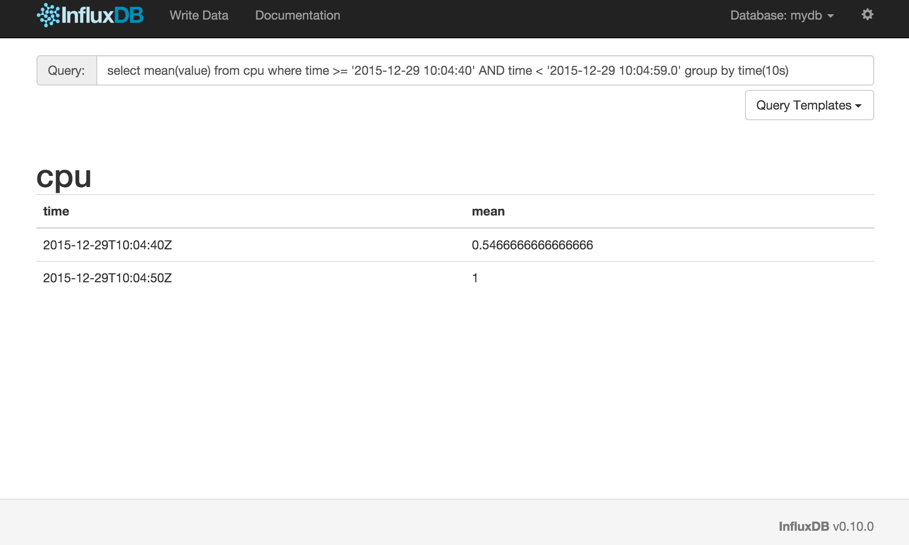

# InfluxDB

---


## Time Series Database

^ Time Series Data
^ Sensor Data, Logdata, Events
^ Basically everything that is time based
^ InfluxDB is made to store a large volume of time-series data and perform real-time analysis on those data, quickly.

---


---

# Use Cases

^ Statistics
^ Agregate huge amounts of data
^ Monitoring & Alerting

---

# Data Model

^ Schema less
^ Key-Value on Time Event
^ Values can be strings, floats, integers, or booleans

---

```
brew install InfluxDB
influxd -config /usr/local/etc/influxdb.conf
```

---



---

# Query Language

---

```SQL
SELECT
  COUNT(duration) as count_duration,
  MIN(duration) as min,
  MAX(duration) as max,
  MEAN(duration) as MEAN
FROM events
WHERE time > now() - 1h
GROUP BY time(30s)
```

^ Percentile and others also available
^ You can do joins ad merges

---

```SQL
INSERT cpu_load,server_name=gilbert value=2
```

^ Values can be strings, floats, integers, or booleans
^ Tags are indexed and can be strings

---

# Retention

---

```SQL
CREATE RETENTION POLICY two_hours
  ON food_data DURATION 2h REPLICATION 1 DEFAULT
```

---

## Downsampling

^ InfluxDB can handle hundreds of thousands of data points per second.
^ A natural solution is to downsample the data; keep the high precision raw data for only a limited time, and store the lower precision, summarized data for much longer or forever.
^ do precalculations
^ organize the data in a different way

---

```SQL
CREATE CONTINUOUS QUERY cq_30m ON food_data
BEGIN
  SELECT mean(website) AS mean_website,
         mean(phone) AS mean_phone
  INTO food_data."default".downsampled_orders
  FROM orders
  GROUP BY time(30m)
END
```

---

# Telegraf

^ plugin-driven server agent for collecting & reporting metrics.
^ brew install telegraf

---

```
aerospike, apache, bcache, couchdb, disque,
dns query time, docker, dovecot, elasticsearch,
exec, haproxy, httpjson, influxdb, jolokia, leofs,
lustre2, mailchimp, memcached, mesos,
mongodb, mysql, net_response, nginx,
nsq, phpfpm, phusion passenger, ping,
postgresql, powerdns, procstat, prometheus,
puppetagent, rabbitmq, raindrops, redis, rethinkdb,
riak, sensors, snmp, sql server, twemproxy, zfs,
zookeeper, win_perf_counters, system, cpu, mem, net,
netstat, disk, diskio, swap, statsd, mqtt_consumer,
kafka_consumer, nats_consumer, github_webhooks
```

^ Input Plugins

---

```
influxdb, amon, amqp, aws kinesis,
aws cloudwatch, datadog, graphite,
kafka, librato, mqtt, nsq, opentsdb,
prometheus, riemann
```

^ Output plugins

---

```
telegraf -sample-config
  -input-filter cpu
  -output-filter influxdb
  > telegraf.conf
```

---

```
[[outputs.influxdb]]
  urls = ["http://localhost:8086"]
  database = "telegraf"
  precision = "s"
```

---

```
[[inputs.cpu]]
  percpu = true
  totalcpu = true
  drop = ["time_*"]
```

---

```
telegraf -config telegraf.conf
```

---

# Chronograf

^ TIME-SERIES DATA VISUALIZATION DOCS
^ https://influxdata.com/time-series-platform/chronograf/

---

# Kapacitor

^ Kapacitor is a data processing engine. It can process both stream and batch data. This guide will walk you through both workflows and teach you the basics of using and running a Kapacitor daemon.

^ https://docs.influxdata.com/kapacitor/v0.10/introduction/getting_started/

---


---

> Bodo Tasche
> @bitboxer
-- CTO bitcrowd

---

# Credits

```
* Time Series Image CC-BY-2.0 Ian Sane https://www.flickr.com/photos/31246066@N04/5261957053
```
