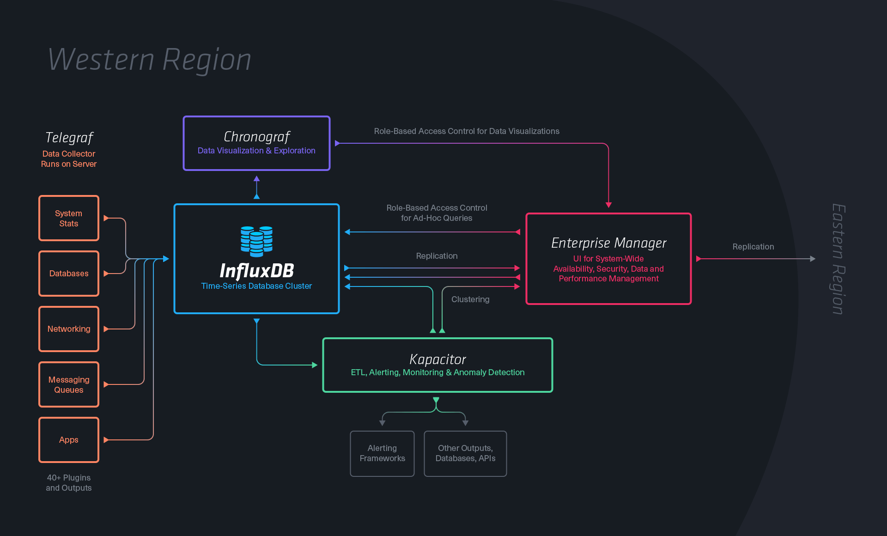
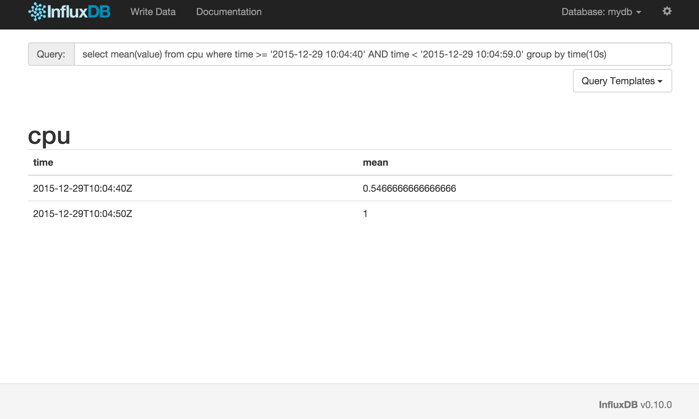
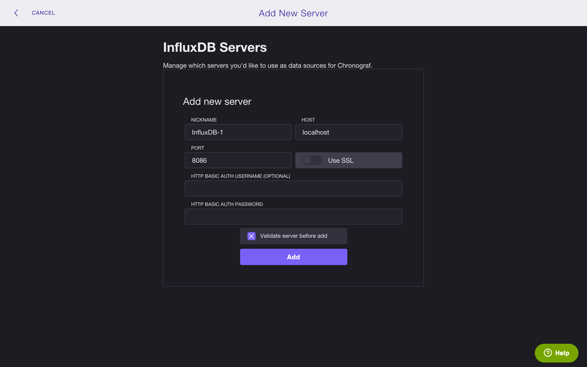
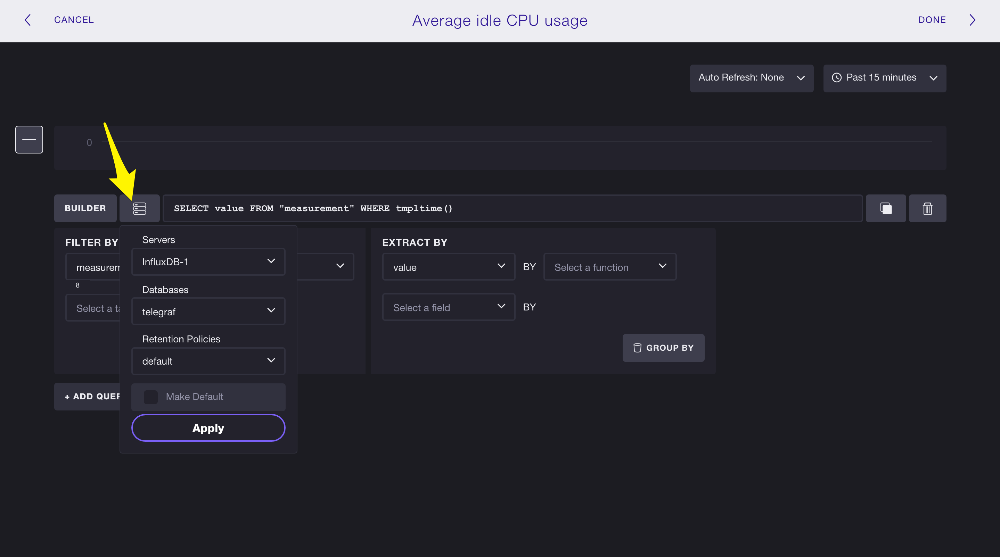
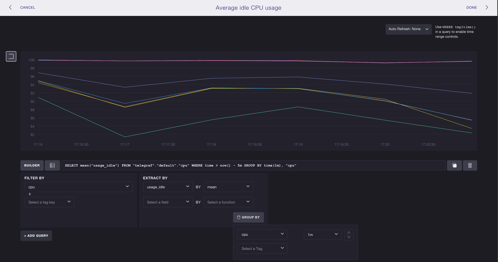
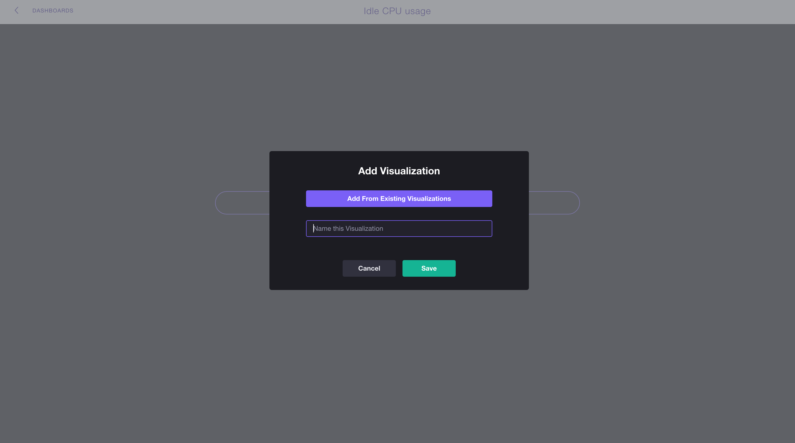
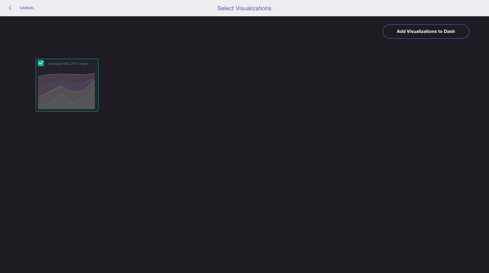

# InfluxDB

---


## Time Series Database

^ Time Series Data

^ Sensor Data, Logdata, Events

^ Basically everything that is time based

^ InfluxDB is made to store a large volume of time-series data and perform real-time analysis on those data, quickly.

---



---

# Use Cases

^ Statistics

^ Agregate huge amounts of data

^ Monitoring & Alerting

---

# Data Model

^ Schema less

^ Key-Value on Time Event

---

* String
* Integer
* Floats
* Boolean

---

```
influxd -config /usr/local/etc/influxdb.conf
```

---



---

# Query Language

---

```SQL
SELECT
  COUNT(duration) as count_duration,
  MIN(duration) as min,
  MAX(duration) as max,
  MEAN(duration) as MEAN
FROM events
WHERE time > now() - 1h
GROUP BY time(30s)
```

^ Percentile and others also available

^ You can do joins ad merges

---

```SQL
INSERT cpu_load,server_name=gilbert value=2
```

^ Values can be strings, floats, integers, or booleans

^ Tags are indexed and can be strings

---

```bash
curl -i -XPOST 'http://localhost:8086/write?db=mydb'
  --data-binary 'cpu_load,server_name=gilbert value=2'
```

---

# Retention

---

```SQL
CREATE RETENTION POLICY two_hours
  ON food_data DURATION 2h REPLICATION 1 DEFAULT
```

---

## Downsampling

^ InfluxDB can handle hundreds of thousands of data points per second.

^ A natural solution is to downsample the data; keep the high precision raw data for only a limited time, and store the lower precision, summarized data for much longer or forever.

^ do precalculations

^ organize the data in a different way

---

```SQL
CREATE CONTINUOUS QUERY cq_30m ON food_data
BEGIN
  SELECT mean(temperature) AS mean_temperature,
         mean(delivery_time) AS mean_delivery_time
  INTO food_data."default".downsampled_orders
  FROM orders
  GROUP BY time(30m)
END
```

---

# Telegraf

^ plugin-driven server agent for collecting & reporting metrics.

^ brew install telegraf

---

## Input Plugins

```
aerospike, apache, bcache, couchdb, disque, dns query time, docker,
dovecot, elasticsearch, exec, haproxy, httpjson, influxdb, jolokia,
leofs, lustre2, mailchimp, memcached, mesos, mongodb, mysql,
net_response, nginx, nsq, phpfpm, phusion passenger, ping, postgresql,
powerdns, procstat, prometheus, puppetagent, rabbitmq, raindrops,
redis, rethinkdb, riak, sensors, snmp, sql server, twemproxy, zfs,
zookeeper, win_perf_counters, system, cpu, mem, net, netstat, disk,
diskio, swap, statsd, mqtt_consumer, kafka_consumer, nats_consumer,
github_webhooks
```

---

## Output Plugins

```
influxdb, amon, amqp, aws kinesis,
aws cloudwatch, datadog, graphite,
kafka, librato, mqtt, nsq, opentsdb,
prometheus, riemann
```

^ Output plugins

---

```
telegraf -sample-config
  -input-filter cpu
  -output-filter influxdb
  > telegraf.conf
```

---

```
[[outputs.influxdb]]
  urls = ["http://localhost:8086"]
  database = "telegraf"
  precision = "s"
```

---

```
[[inputs.cpu]]
  percpu = true
  totalcpu = true
  drop = ["time_*"]
```

---

```
telegraf -config telegraf.conf
```

---

# Chronograf

^ TIME-SERIES DATA VISUALIZATION DOCS

^ https://influxdata.com/time-series-platform/chronograf/

---


```
chronograf
```

---



^ Add a new server

---



^ Add a new graph

---



---



^ Go do Dashboard, add new dashboard, add a visualation you created previously

---



---


---

> GitLab Performance Monitoring: a monitoring system using InfluxDB [...] then visualized using Grafana
-- [Gitlab Performance Blogpost](https://about.gitlab.com/2016/02/25/making-gitlab-faster/)

---

# Kapacitor

^ Kapacitor is a data processing engine. It can process both stream and batch data.

^ run this as addition to icinga / nagios

^ https://docs.influxdata.com/kapacitor/v0.10/introduction/getting_started/

---


```
kapacitord config > kapacitor.conf
```

---

```
kapacitord -config kapacitor.conf
```

---

## cpu_alert.tick

```js
stream
    // Select just the cpu measurement
    .from().measurement('cpu')
    .alert()
        .crit(lambda: "usage_idle" <  70)
        // Whenever we get an alert write it to a file.
        .log('/tmp/alerts.log')
```

---

```bash
kapacitor define \
    -name cpu_alert \
    -type stream \
    -tick cpu_alert.tick \
    -dbrp kapacitor_example.default
```

---

```
kapacitor enable cpu_alert
```

---

```javascript
stream
    .from().measurement('cpu')
    .alert()
        // Compare values to running mean and standard deviation
        .crit(lambda: sigma("usage_idle") > 3)
        .log('/tmp/alerts.log')
```

^ trigger an alert if the values are more than 3 standard deviations away from the mean

---

```javascript
stream
    .from().measurement('cpu_usage_idle')
    .groupBy('host')
    .window().period(1m).every(1m)
    .mapReduce(influxql.mean('value'))
    .eval(lambda: 100.0 - "mean").as('used')
    .alert()
        .message('{{ .Level}}: {{ .Name }}/{{ index .Tags "host" }} has ' +
                 'high cpu usage: {{ index .Fields "used" }}')
        .warn(lambda: "used" > 70.0)
        .crit(lambda: "used" > 85.0)
        .slack().channel('#alerts')
        .pagerDuty()

```

^ In the examples of Kapacitor you will find more interesting stuff. Calculating
the top scorers of a Game from the InfluxDB Measurements or detecting anomalies and
alerting them

---


---

> Bodo Tasche
> @bitboxer
-- CTO bitcrowd

---

# Credits

```
* Time Series Image CC-BY-2.0 Ian Sane
  https://www.flickr.com/photos/31246066@N04/5261957053
```
