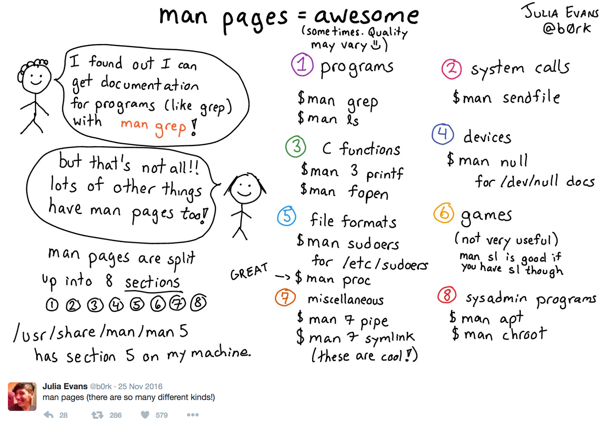
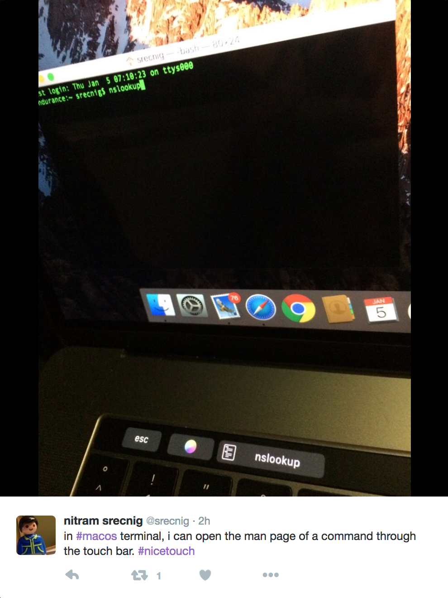
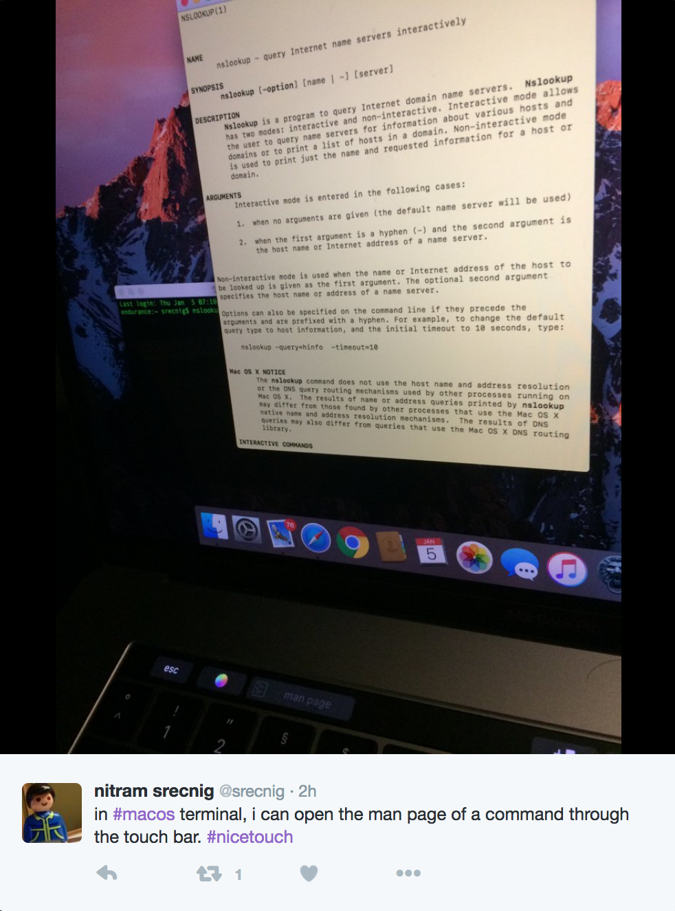
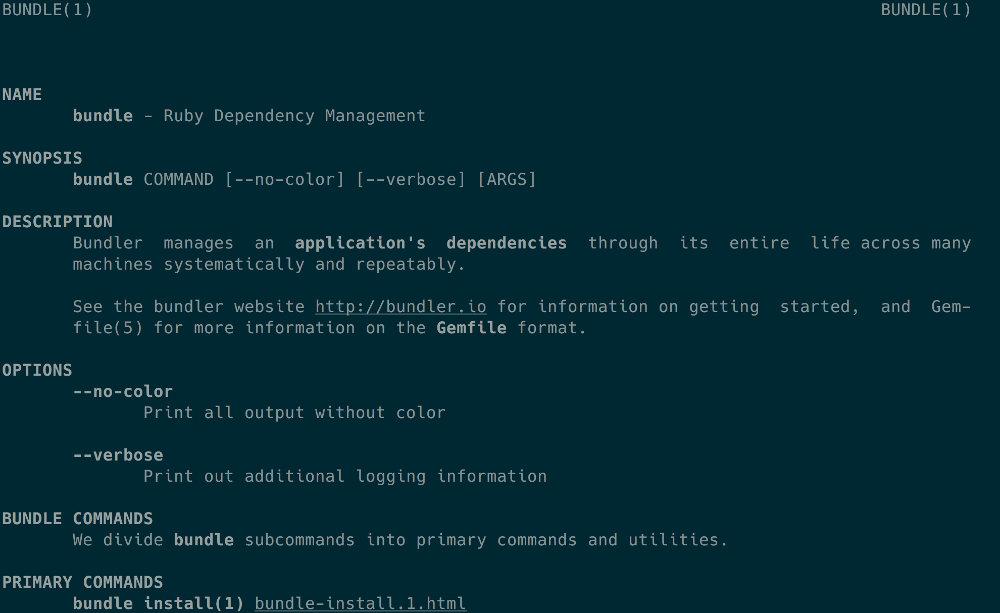

> Bodo Tasche
> @bitboxer

---

# manpages

---

```
> man sl
```

---



---



---



---

# ruby?

---

```
> man bundle
No manual entry for bundle
```

---

[https://github.com/defunkt/gem-man](https://github.com/defunkt/gem-man)

^ 7 years old

---

```
> gem man bundle

```
---



----

```
> gem install manpages && gem manpages --update-all
> man bundle
```

^ Disclaimer: rbenv needs more work

---

[https://github.com/bitboxer/manpages](https://github.com/bitboxer/manpages)

---

* [ronn](https://rtomayko.github.io/ronn/)
* [kramdown](https://kramdown.gettalong.org/converter/man.html)

^ Markdown files

---

## man folder in gem root

---

> Bodo Tasche
> @bitboxer

[https://github.com/bitboxer/manpages](https://github.com/bitboxer/manpages)
