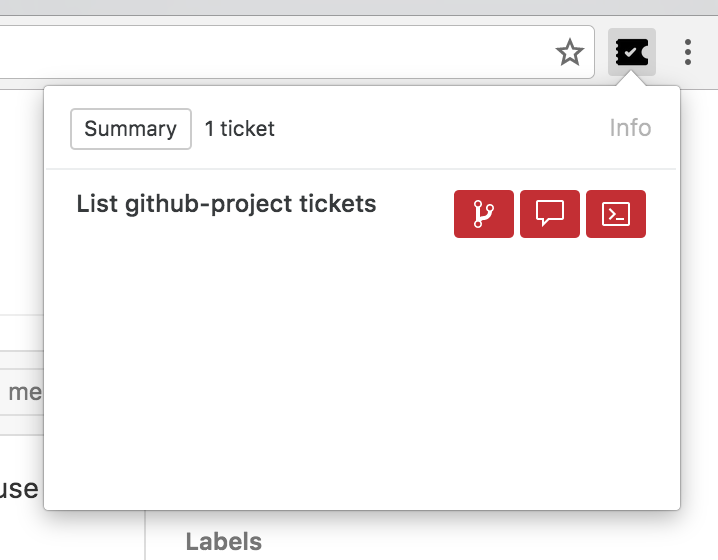

> Bodo Tasche
> @bitboxer

CTO bitcrowd

---

## Convention over configuration

^ We rubiest love that slogan. And
it is easy to understand why.
^ Lots of files have a place to be,
we don't have to think about where
they go, or what to do.

---

## What about git?

^ But what about git?
^ If developer alice worked on something
and had to stop because of illness,
where can developer justine find it?
^ At bitcrowd we have convetions for that

---

```
feature/1234-example-ticket
```

^ This is how a branch looks like

---

```
[#1234] Example ticket
```

^ And this is how a ticket looks like

---

## copy and pasting ?!

---


---


---



---

```
git checkout -b 'feature/35-list-github-project-tickets' &&
git commit --allow-empty -m '[#35] List github-project tickets'
```

---

* Github
* Gitlab
* Jira
* Pivotal Tracker
* Trello

---

* React
* Gulp
* WebExtensions API

^ web extension api => Firefox, Chrome, Opera, (Maybe IE latest), Safari

---

## [bit.ly/ticketytick](http://bit.ly/ticketytick)
